# 👋 Hallo, ich bin Aksel Kenanov!

Ich bin ein Master-Student im ersten Fachsemester mit Fokus auf *Software Engineering* und *Cloud Computing*.

Ich liebe es, technische Probleme kreativ zu lösen und ständig neue Tools & Technologien zu entdecken.

---

## 📑 Inhaltsverzeichnis
### 🏢 Praxisphase SAP Payments Bridge
* [🏢 Praxisphase](#-praxisphase)
### Bachelorarbeit – Evaluation des OpenTelemetry-Overheads in AWS Lambda
* [🎓 Bachelorarbeit](#-bachelorarbeit)
### 🧰 Technologien & Tools

* [💻 Programmiersprachen](#-programmiersprachen)
* [🌐 Web & Application Development](#-web--application-development)
* [⚙️ C / C++ Development](#️-c--c-development)
* [☕ Java Development](#-java-development)
* [🐍 Python & Machine Learning](#-python--machine-learning)
* [🐘 PHP Development](#-php-development)
* [🗄️ Datenbanken](#️-datenbanken)
* [☁️ Cloud & DevOps](#️-cloud--devops)
* [🧪 Testing & Qualitätssicherung](#-testing--qualitätssicherung)
* [📊 Observability](#-observability)
* [🔄 Agile Softwareentwicklung](#-agile-softwareentwicklung)

### 💼 Projekte

* [📊 Event Planner Webanwendung](#-event-planner-webanwendung)
* [📱 Buchungsverwaltungssystem](#-buchungsverwaltungssystem)
* [✈️ Reisebüro Simulation](#️-reisebüro-simulation)
* [💼 Job-Portal](#-job-portal)
* [🌍 Reiseplanung Webanwendung](#-reiseplanung-webanwendung)
* [🖥️ Übungsseite für Betriebssysteme](#️-übungsseite-für-betriebssysteme)
* [☕ Java Spring Boot Anwendung – Weiterentwicklung & Bug-Fixes](#-java-spring-boot-anwendung--weiterentwicklung--bug-fixes)
* [🤖 Künstliche Intelligenz & Machine Learning](#-künstliche-intelligenz--machine-learning)

### 📫 Weitere Informationen

* [📫 Kontakt & Profile](#-kontakt--profile)

---
---

# 🏢 Praxisphase

## 🏗️ SAP Payments Bridge

> Im Rahmen meiner Praxisphase wurde eine resiliente, event-driven Microservice-Architektur für die Verarbeitung von SAP-Payments entwickelt. Der Schwerpunkt lag auf Ausfallsicherheit, zuverlässiger Nachrichtenverarbeitung und Observability.

### 🔗 Repository

[Repository](https://github.com/justaksi7/b2b-sap-payment-bridge)

### 🛠️ Technologien & Tools

**AWS** · **AWS Lambda** · **Amazon SQS** · **Amazon RDS** · **Amazon DynamoDB** · **AWS X-Ray** · **Amazon CloudWatch** · **OpenTelemetry** · **REST APIs** · **Microservices**

### 🏛️ Architektur

- Serverless Microservice-Architektur
- Event-driven Architecture
- REST APIs
- Asynchrone Kommunikation über **Amazon SQS**
- Persistierung mit **Amazon RDS**
- Outbox Pattern
- Worker-basierte Verarbeitung
- Integration mit SAP
- Webhook-basierte Statusaktualisierung

### 🛡️ Resilienz & Fehlertoleranz

- Retry-Mechanismen mit **Exponential Backoff**
- **Dead Letter Queues (DLQ)**
- Circuit Breaker Pattern
- Half-Open-Phase für kontrollierte Wiederherstellung
- Schutz vor mehrfacher Verarbeitung von Payments
- Zuverlässige und fehlertolerante Nachrichtenverarbeitung
- Zustandsbasierte Verarbeitung von Payments

### 📊 Observability

- **OpenTelemetry**
- **AWS X-Ray**
- **Amazon CloudWatch**
- Distributed Tracing
- Correlation IDs
- Logging
- Metrics
- Monitoring
- Queue- und DLQ-Monitoring

### 👨‍💻 Rolle

Cloud Solution Architect im Rahmen der Praxisphase.

### 🖼️ Screenshots

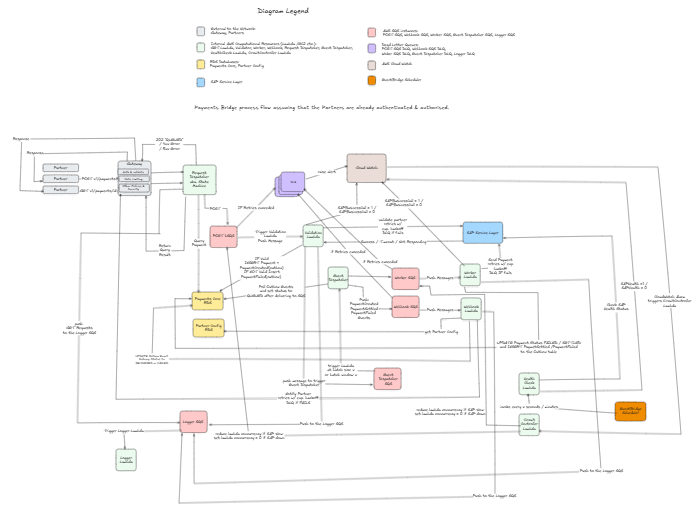

⬆️ [Zurück zum Inhaltsverzeichnis](#-inhaltsverzeichnis)

---
---
# 🎓 Bachelorarbeit

## 📊 Evaluation des OpenTelemetry-Overheads in AWS Lambda

> Im Rahmen meiner Bachelorarbeit wurde der Performance- und Ressourcen-Overhead durch OpenTelemetry-Instrumentierung in AWS-Lambda-Workloads untersucht. Dabei wurden Lambda-Funktionen in **Java, Node.js und Python** sowohl ohne Instrumentierung als auch mit OpenTelemetry ausgeführt und miteinander verglichen.

### 🔗 Repository

[📂 GitHub Repository](https://github.com/justaksi7/opentelemetry-overhead-java-nodejs-python)

### 🛠️ Technologien & Tools

**AWS Lambda** · **Java** · **Node.js** · **Python** · **OpenTelemetry** · **Amazon DynamoDB** · **AWS CloudWatch** · **HTTP** · **GitHub**

### 🎯 Zielsetzung

Untersuchung der Auswirkungen von OpenTelemetry-Instrumentierung auf die Performance und den Ressourcenverbrauch serverloser Anwendungen.

Verglichen wurden:

* Nicht instrumentierte Lambda-Funktionen (**Baseline**)
* Mit OpenTelemetry instrumentierte Lambda-Funktionen
* Drei Programmiersprachen: **Java, Node.js und Python**
* **Kaltstarts und Warmstarts**

### 🧪 Microbenchmarks

Für die Evaluation wurden fünf verschiedene Zugriffsszenarien untersucht:

* **Lambda-to-Lambda Invocation**

  * Asynchroner Aufruf einer zweiten Lambda-Funktion
  * Untersuchung der Tracing- und Context-Propagation-Kosten

* **HTTP GET Request**

  * Ausgehende HTTP-Kommunikation
  * Untersuchung von Client-Spans und Header-/Context-Propagation

* **HTTP POST Request**

  * Ausgehende HTTP-Kommunikation mit Request-Body
  * Untersuchung von Request-/Response-Tracing und zusätzlicher Instrumentierung

* **DynamoDB Read**

  * Lesen eines einzelnen Datensatzes aus Amazon DynamoDB

* **DynamoDB Write**

  * Schreiben eines einzelnen Datensatzes in Amazon DynamoDB

Damit werden Lambda-Aufrufe, HTTP-Kommunikation sowie Datenbankzugriffe innerhalb einer AWS-Umgebung abgedeckt.

### 📏 Gemessene Metriken

* **Duration**
* **Init Duration**
* **Max Memory Used**
* Relativer OpenTelemetry-Overhead in Prozent
* Absolute Messwerte
* Vergleich von Kalt- und Warmstarts

Die Messungen wurden zwischen dem **02.03.2026 und 07.03.2026** durchgeführt.

### 📈 Ergebnisse

Die Evaluation zeigt deutliche Unterschiede zwischen den Programmiersprachen und den verschiedenen Ausführungsszenarien.

Bei **Kaltstarts** zeigte sich insbesondere ein deutlicher zusätzlicher Initialisierungsaufwand durch die Instrumentierung. Beispielsweise lag der gemessene Init-Duration-Overhead bei den HTTP-POST-Benchmarks bei **284,51 % für Java**, **805,21 % für Node.js** und **495,87 % für Python**.

Bei **Warmstarts** fällt der Overhead deutlich geringer aus. Beim Lambda-to-Lambda-Benchmark lag der zusätzliche Duration-Overhead beispielsweise bei **11,80 % für Java**, **19,30 % für Node.js** und **14,13 % für Python**.

Auch beim **Memory-Verbrauch** konnte ein zusätzlicher Ressourcenbedarf der instrumentierten Funktionen beobachtet werden. Die Höhe des Overheads hängt dabei vom verwendeten Benchmark und der jeweiligen Programmiersprache ab.

### 🗂️ Repository-Struktur

Das Repository enthält unter anderem:

* `aws-lambda-functions/` – Lambda-Implementierungen für Java, Node.js und Python
* `aws-http-server/` – HTTP-Testserver für GET- und POST-Benchmarks
* `cloudwatch-logs/` – exportierte Rohdaten und Auswertungsskripte
* `dynamo-db/` – Dokumentation der DynamoDB-Struktur
* `lambda-invocation-script/` – Skript für die Lambda-Invocation-Tests
* `results/` – aufbereitete Ergebnisse und Visualisierungen
* `gfx/` – Grafiken für die Dokumentation

### 👨‍🎓 Rolle

**Autor und Entwickler der Bachelorarbeit**

⬆️ [Zurück zum Inhaltsverzeichnis](#-inhaltsverzeichnis)
---

# 🧰 Technologien & Tools

## 💻 Programmiersprachen

**C / C++** · **Python** · **Java** · **JavaScript / TypeScript** · **SQL** · **Dart** · **PHP**

⬆️ [Zurück zum Inhaltsverzeichnis](#-inhaltsverzeichnis)

---

## 🌐 Web & Application Development

### Frontend

**React** · **TypeScript** · **JavaScript** · **Tailwind CSS**

### Backend

**Node.js** · **Express** · **PHP**

### Weitere Technologien

**REST APIs** · **Responsive Web Design** · **ORM** · **API-Integration**

⬆️ [Zurück zum Inhaltsverzeichnis](#-inhaltsverzeichnis)

---

## ⚙️ C / C++ Development

* Businessanwendungen mit **Qt**
* 3D-Computergrafik mit **Qt 3D**
* Embedded Programming mit **Raspberry Pi Pico**
* Multithreading
* Threads
* Mutexe
* Semaphore

⬆️ [Zurück zum Inhaltsverzeichnis](#-inhaltsverzeichnis)

---

## ☕ Java Development

* **Java**
* **Spring Boot**
* Businessanwendungen
* **Mustache**
* CI/CD mit **GitLab Pipelines**
* Unit Testing
* Software-Metriken mit **SonarQube**

⬆️ [Zurück zum Inhaltsverzeichnis](#-inhaltsverzeichnis)

---

## 🐍 Python & Machine Learning

### Python

**Python** · **NumPy** · **Pandas** · **Matplotlib** · **Scikit-learn**

### Machine Learning

* Feature Engineering
* Classification
* Regression
* Unsupervised Learning
* KNN
* PCA

### Deep Learning

* Artificial Neural Networks
* Convolutional Neural Networks
* **Keras**
* **TensorFlow**

⬆️ [Zurück zum Inhaltsverzeichnis](#-inhaltsverzeichnis)

---

## 🐘 PHP Development

* Backend-Entwicklung
* PHP ohne Framework

⬆️ [Zurück zum Inhaltsverzeichnis](#-inhaltsverzeichnis)

---

## 🗄️ Datenbanken

* **PostgreSQL**
* **DynamoDB**
* **Drizzle ORM**
* **pgAdmin**
* **SAP PowerDesigner**
* Datenbankdesign
* Datenbankadministration
* ORM & Migrationen

⬆️ [Zurück zum Inhaltsverzeichnis](#-inhaltsverzeichnis)

---

## ☁️ Cloud & DevOps

### Cloud

* **AWS**
* Serverless
* Cloud Deployment

### Software Architecture

* Microservices
* REST APIs
* Event-driven Architecture

### DevOps

* **Git**
* **GitHub**
* **GitLab**
* **Bitbucket**
* **Docker**
* **Postman**
* CI/CD
* SonarQube

⬆️ [Zurück zum Inhaltsverzeichnis](#-inhaltsverzeichnis)

---

## 🧪 Testing & Qualitätssicherung

* Unit Testing
* Integration Testing
* API Testing
* Performance Testing
* Load Testing
* Testautomatisierung
* Software Metrics
* SonarQube

⬆️ [Zurück zum Inhaltsverzeichnis](#-inhaltsverzeichnis)

---

## 📊 Observability

* **OpenTelemetry**
* **AWS X-Ray**
* **Amazon CloudWatch**
* Logging
* Metrics
* Distributed Tracing
* Monitoring

⬆️ [Zurück zum Inhaltsverzeichnis](#-inhaltsverzeichnis)

---

## 🔄 Agile Softwareentwicklung

* **SCRUM**
* SCRUM Boards
* Kanban Boards
* Requirements Engineering
* User Research
* Teamarbeit in Softwareprojekten

⬆️ [Zurück zum Inhaltsverzeichnis](#-inhaltsverzeichnis)

---

# 💼 Projekte

## 📊 Event Planner Webanwendung

[🔗 Repository](https://code.fbi.h-da.de/stmifrank/fwe-ss25-event-planner)

> Eine Webanwendung für Event-Planning, angelehnt an Calendly. Die Seite war initial online (AWS), wurde aber aufgrund von Kosten wieder heruntergenommen.

### 🛠️ Stack

**Node.js** · **Express** · **TypeScript** · **React** · **ShadCN** · **PostgreSQL** · **Drizzle ORM** · **Docker** · **AWS**

### ✨ Features

* Express-Server
* PostgreSQL Docker Image
* ORM und Migrationen mit Drizzle ORM
* Validierung mit Zod
* React mit TypeScript
* ShadCN-UI
* AWS Deployment

### 👨‍💻 Rolle

Developer in einem **SCRUM-Team mit 5 Personen**

### 🖼️ Screenshots

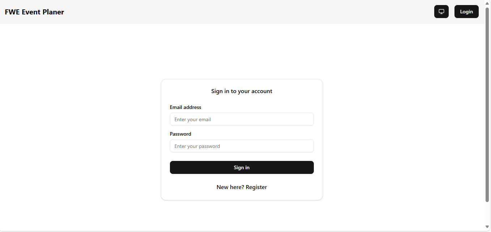

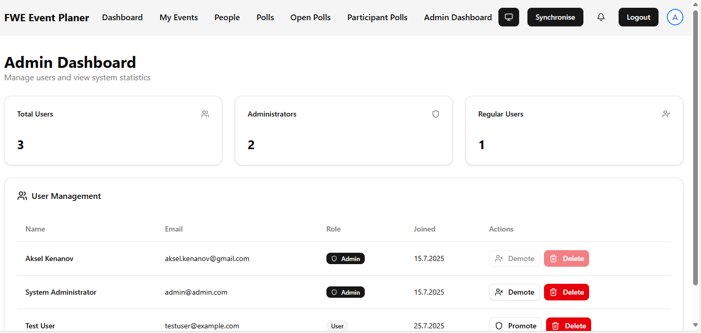

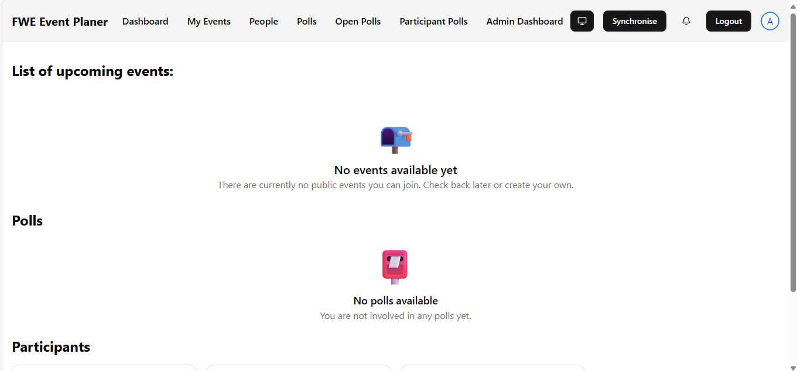

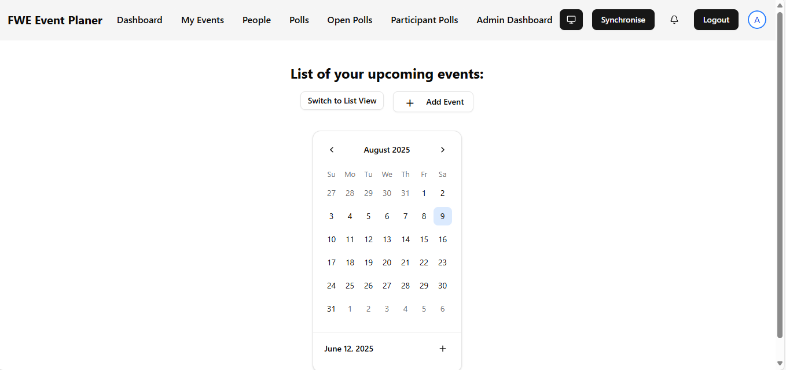

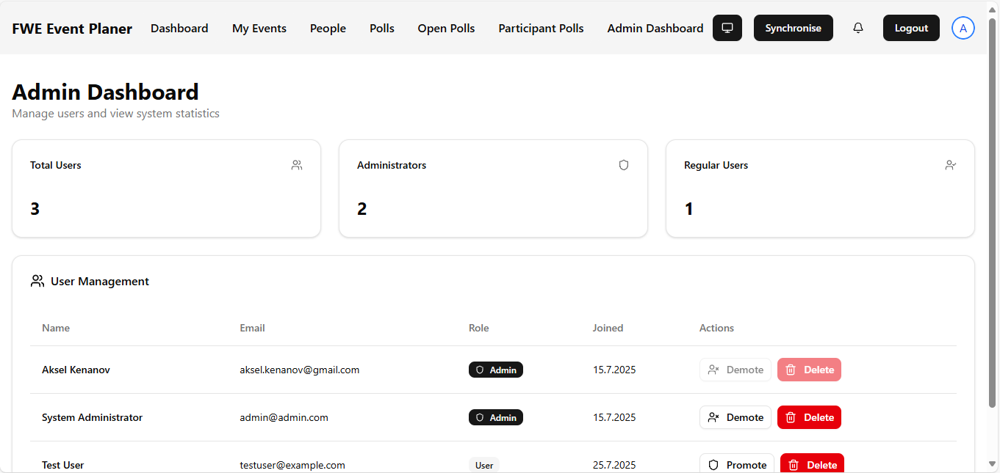

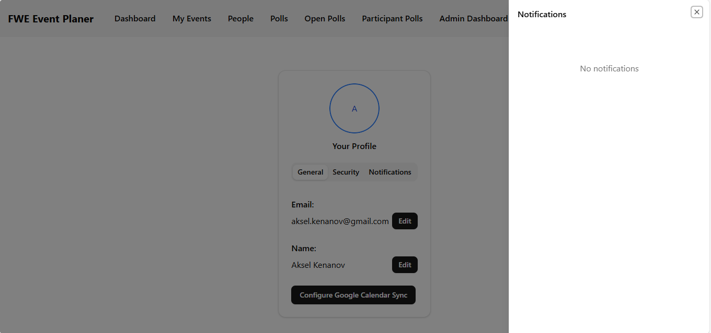

### 🎥 Demo

<video width="600" controls>
  <source src="images/fwe-event-planner/fwe-event-planner-demo.mp4" type="video/mp4">
  Dein Browser unterstützt das Video-Tag nicht.
</video>

[Video Demo](images/fwe-event-planner/fwe-event-planner-demo.mp4)

⬆️ [Zurück zum Inhaltsverzeichnis](#-inhaltsverzeichnis)

---

## 📱 Buchungsverwaltungssystem

> Eine Cross-Platform-App zur Buchung und Verwaltung von Events mit mehreren Nutzern.

### 🛠️ Stack

**Flutter (Dart)** · **PostgreSQL**

### ✨ Features

* Responsive Design
* UX / UI
* Requirements Engineering
* User Research mit echten Nutzern

### 👨‍💻 Rolle

Developer in einem **SCRUM-Team mit 4 Personen**

⬆️ [Zurück zum Inhaltsverzeichnis](#-inhaltsverzeichnis)

---

## ✈️ Reisebüro Simulation

> Eine C++ Desktopanwendung mit Qt.

### 🛠️ Stack

**C++** · **Qt** · Gemockte JSON-Datenbank

### ✨ Features

* Graph-Algorithmen
* Vermeidung von Datumkonflikten
* Desktop GUI

### 👨‍💻 Rolle

**Solo-Projekt**

⬆️ [Zurück zum Inhaltsverzeichnis](#-inhaltsverzeichnis)

---

## 💼 Job-Portal

> Eine Job-Portal-Simulation mit Fokus auf das Frontend.

### 🛠️ Stack

**React** · **JavaScript** · **Tailwind CSS** · Gemockter JSON-Server

### ✨ Features

* JSON-Server Parsing
* Verschiedene React Hooks
* React-Toastify
* Responsive Frontend

### 👨‍💻 Rolle

**Solo-Projekt**

### 🖼️ Screenshots

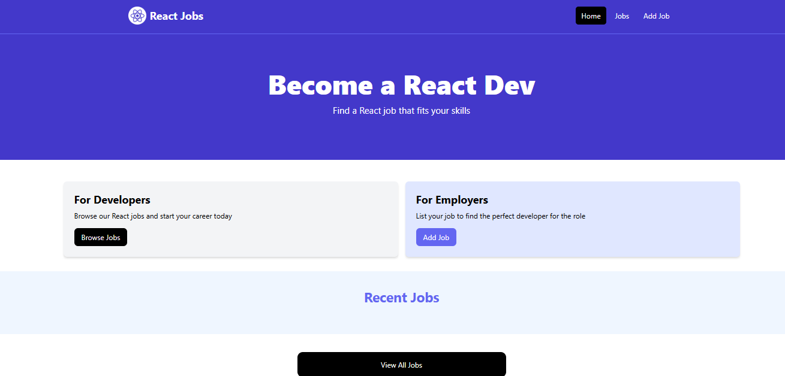

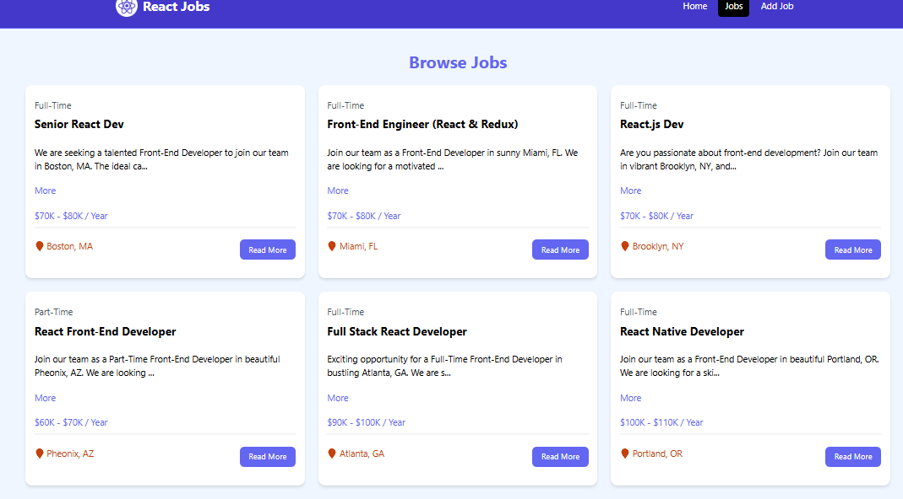

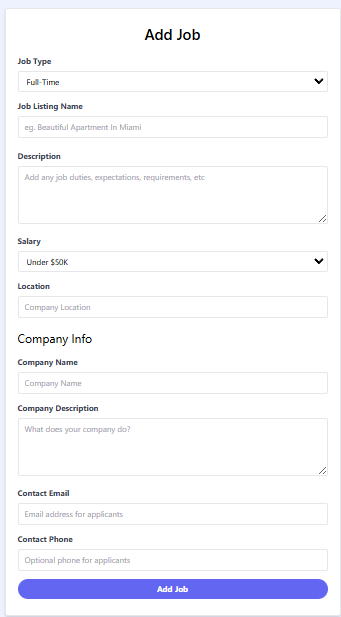

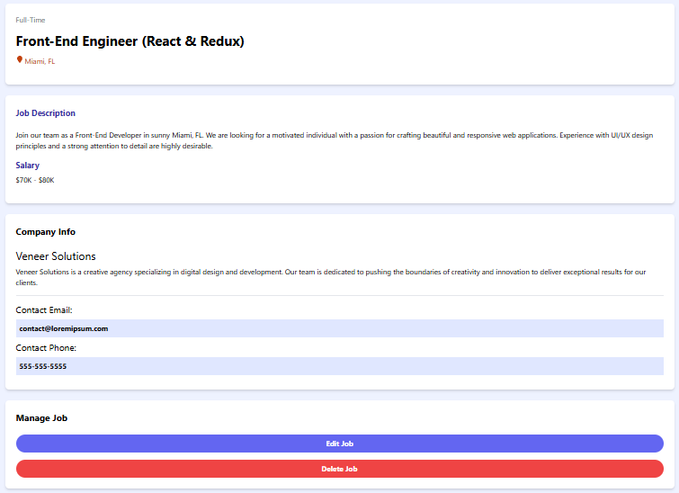

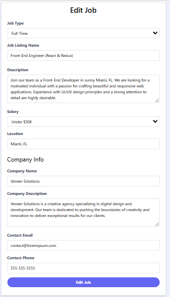

⬆️ [Zurück zum Inhaltsverzeichnis](#-inhaltsverzeichnis)

---

## 🌍 Reiseplanung Webanwendung

[🔗 Repository](https://code.fbi.h-da.de/aksel.kenanov/fwe-ss-25-1118200)

> Eine Reiseplanungs-Web-App mit Reisen, Reisezielen und Wettervorhersagen.

### 🛠️ Stack

**Node.js** · **Express** · **TypeScript** · **React** · **Tailwind CSS** · **PostgreSQL** · **Drizzle ORM**

### ✨ Features

* Express-Server
* PostgreSQL Docker Image
* ORM und Migrationen mit Drizzle ORM
* Validierung mit Zod
* Externe REST-API für Wettervorhersagen
* React Frontend
* Tailwind CSS

### 👨‍💻 Rolle

**Solo-Projekt**

### 🖼️ Screenshots

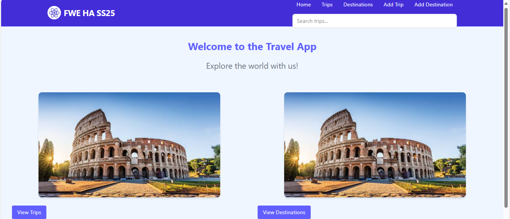

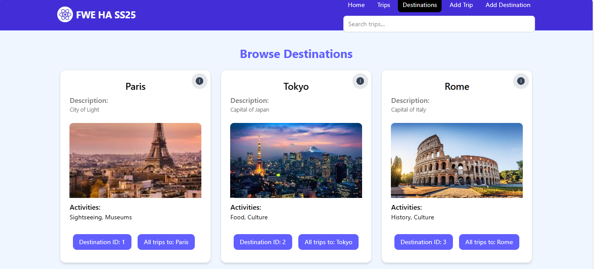

### 🎥 Demo

<video width="600" controls>
  <source src="images/react-travel-agency/react-travel-agency-demo.mp4" type="video/mp4">
  Dein Browser unterstützt das Video-Tag nicht.
</video>

[Video Demo](images/react-travel-agency/react-travel-agency-demo.mp4)

⬆️ [Zurück zum Inhaltsverzeichnis](#-inhaltsverzeichnis)

---

## 🖥️ Übungsseite für Betriebssysteme

[🔗 Repository](https://code.fbi.h-da.de/azizarrahmen.chihaoui/pse-react)

> Eine interaktive React-Anwendung zum Üben verschiedener Algorithmen aus dem Bereich Betriebssysteme, z. B. Banker-Algorithmus, Scheduler und Deadlock Detection. Die Webanwendung wird tatsächlich von der Hochschule Darmstadt deployed, damit neue Studierende interaktiv für die Vorlesung Betriebssysteme lernen können.

### 🛠️ Stack

**React** · **TypeScript** · **Tailwind CSS** · **PostgreSQL**

### ✨ Features

* Interaktive Scheduling-Algorithmen
* Banker-Algorithmus
* Scheduler
* Deadlock Detection
* Tokens für spezifische Aufgaben
* PostgreSQL Leaderboard

### 👨‍💻 Rolle

Developer in einem **SCRUM-Team mit 5 Personen**

### 🖼️ Screenshots

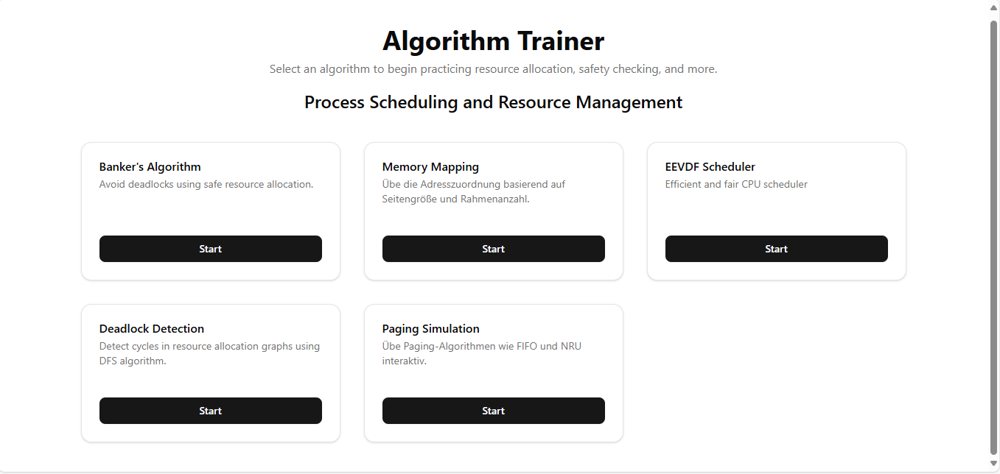

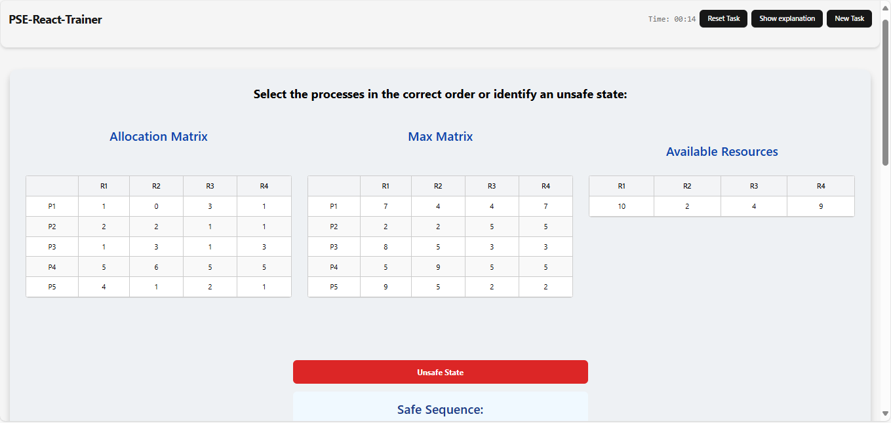

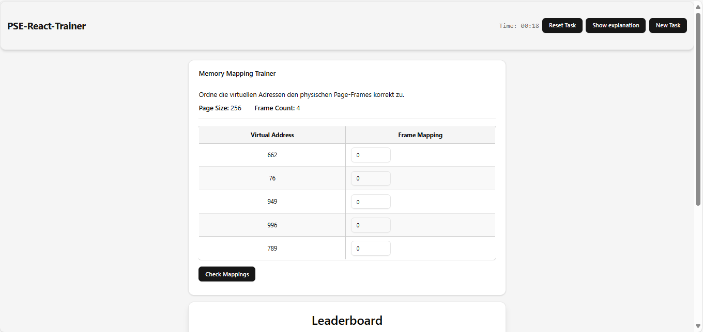

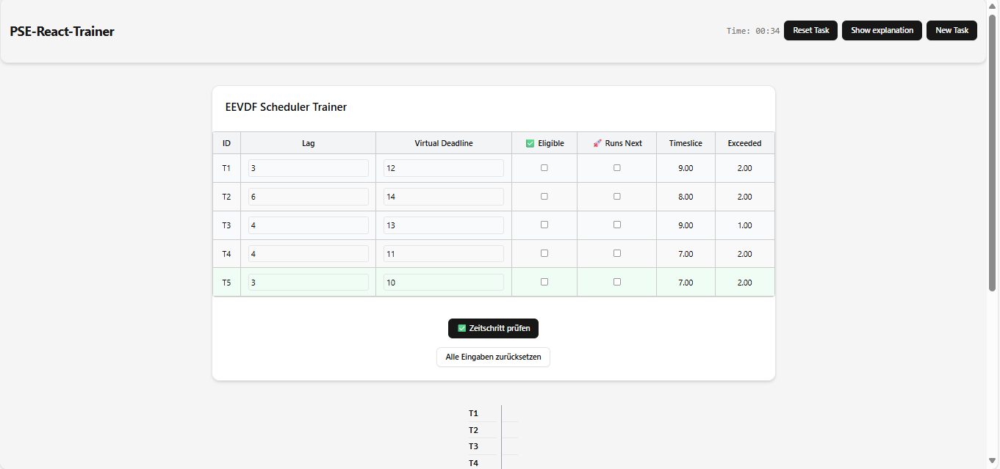

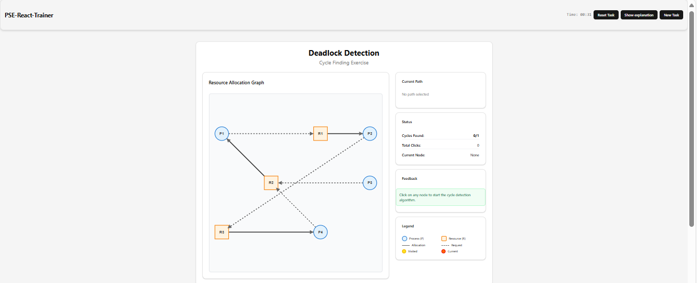

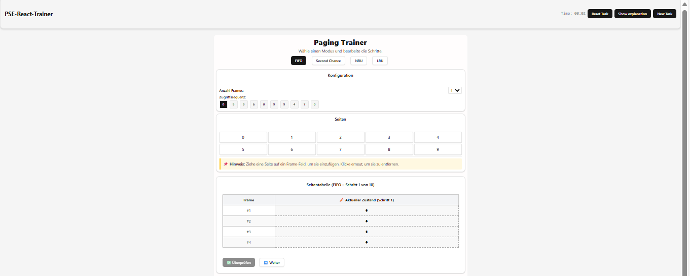

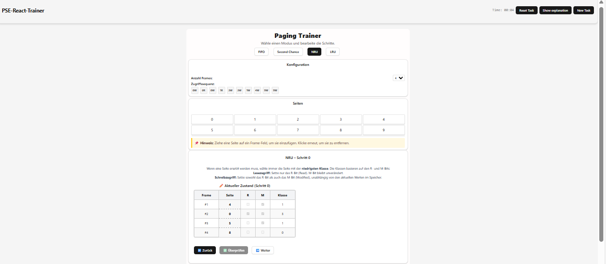

### 🎥 Demo

<video width="600" controls>
  <source src="images/react-trainer/react-trainer-demo.mp4" type="video/mp4">
  Dein Browser unterstützt das Video-Tag nicht.
</video>

[Video Demo](images/react-trainer/react-trainer-demo.mp4)

⬆️ [Zurück zum Inhaltsverzeichnis](#-inhaltsverzeichnis)

---

## ☕ Java Spring Boot Anwendung – Weiterentwicklung & Bug-Fixes

> Eine Java-Web-Anwendung mit Spring Boot.

### 🛠️ Stack

**Java Spring Boot** · **Mustache** · **Apache Tomcat** · App-interne Hash-Repositories

### ✨ Features

* Interne Quasi-Datenbank mit Hash-Repositories
* Authentifizierung mit Passwort-Validierung
* Layouts mit Mustache
* CI/CD mit GitLab Pipelines
* Unit Tests
* Software-Metriken mit SonarQube

### 👨‍💻 Rolle

Developer in einem **SCRUM-Team mit 4 Personen**

### 🖼️ Screenshots

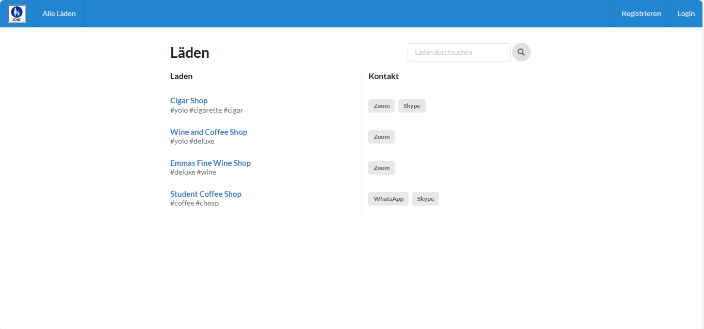

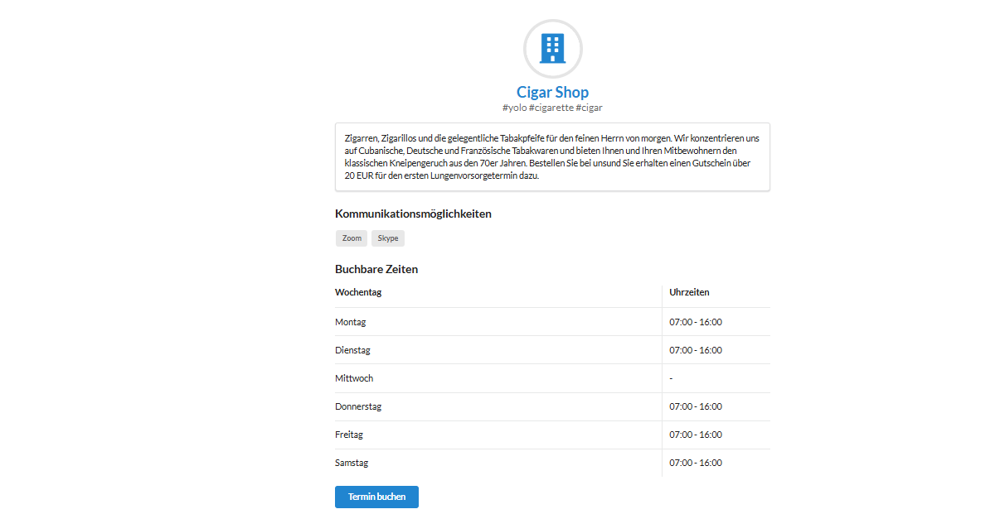

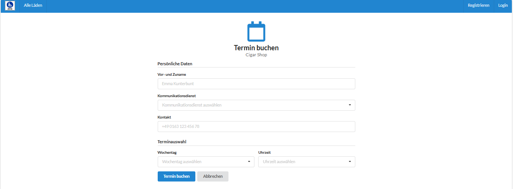

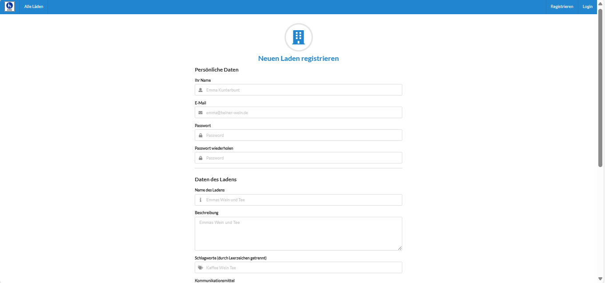

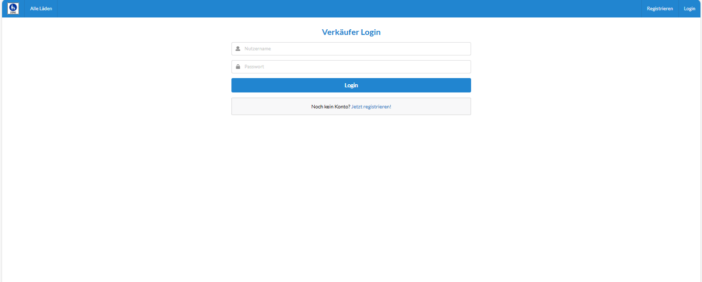

⬆️ [Zurück zum Inhaltsverzeichnis](#-inhaltsverzeichnis)

---

## 🤖 Künstliche Intelligenz & Machine Learning

> Im Rahmen der Vorlesung „Einführung in die Künstliche Intelligenz“ entwickelte Python-Skripte und Anwendungen.

### 🛠️ Stack

**Python** · **Scikit-learn** · **NumPy** · **Matplotlib** · **Pandas** · **Keras** · **TensorFlow**

### 📈 Classification

Vorhersage der Personen, die den Titanic-Unfall überlebt haben, mittels **Feature Engineering** und **Classification**.

### 📊 Regression

Vorhersage der Umsätze von Filmen aus **The Movie Database** mittels Feature Engineering und Regression.

### 🧠 Convolutional Neural Networks

Klassifikation handgeschriebener Bilder anhand von **CNNs** mit Keras und TensorFlow.

### 🖼️ CNN Beispiel

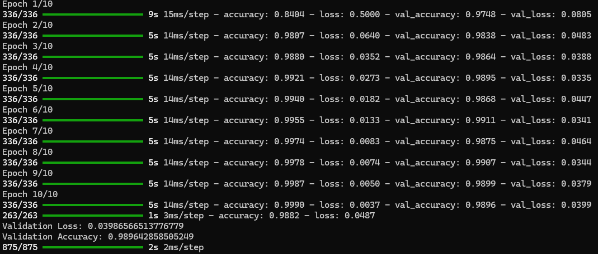

### 🔍 Unsupervised Learning

* KNN-Algorithmus
* PCA-Transformation
* Verbesserung der Klassifikation
* Generierung neuer Bilder mit PCA-Inverse-Transformation

### 🖼️ Unsupervised Learning Beispiele

### 👨‍💻 Rolle

**Solo-Projekte**
⬆️ [Zurück zum Inhaltsverzeichnis](#-inhaltsverzeichnis)

---
---
## 🎓 Bachelorarbeit
⬆️ [Zurück zum Inhaltsverzeichnis](#-inhaltsverzeichnis)
---
# 📫 Kontakt & Profile

* 🧑‍💻 [GitHub](https://github.com/justaksi7)
* ✉️ [aksel.kenanov@gmail.com](mailto:aksel.kenanov@gmail.com)

⬆️ [Zurück zum Inhaltsverzeichnis](#-inhaltsverzeichnis)

---

> 📌 *Manche Projekte haben keine Repository-Links und/oder Screenshots, weil sie hochschulintern sind (Datenschutz).*
>
> 📌 *Dieses Profil ist noch im Aufbau – Feedback und Anregungen willkommen!*
